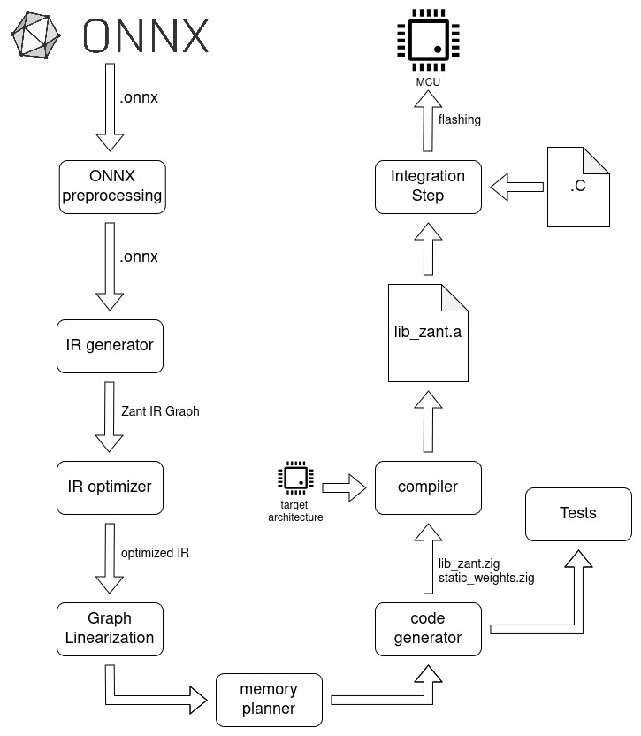
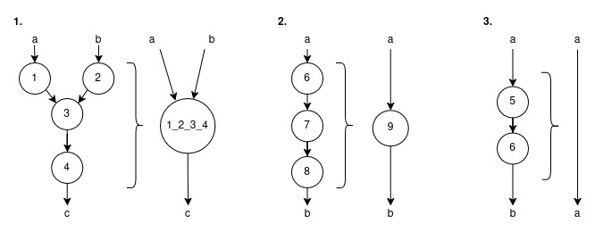
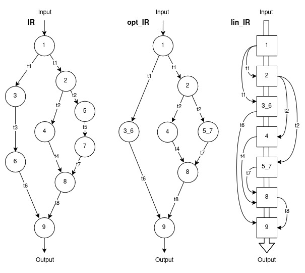

# Zant Workflow

Table of Content
[Model pre-processing](#model-pre-processing)  
[IR Generator](#ir-generator)  
[IR Optimizer](#ir-optimizer)  
[Graph Linearization](#graph-linearization)  
[Memory Planning Strategies](#memory-planning-strategies)  
[Code Generator](#code-generator)  
[Correctness Validation Against ONNX Runtime](#correctness-validation-against-onnx-runtime)  
[Compiling for a Target Architecture](#compiling-for-a-target-architecture)  


The purpose of this guide is to describe the methodology underlying Zant’s toolchain. We detail the full compilation pipeline-from ONNX model ingestion to architecture-specific binary generation-emphasizing the design choices that enable deterministic, memory-safe deployment on microcontrollers. Each stage of the process, from model pre-processing and intermediate representation (IR) construction to optimization, memory planning, and code generation, contributes to ensuring that inference can be executed with statically proven resource bounds.

The file also explains how correctness and reproducibility are enforced: numerical equivalence against ONNX Runtime validates functional fidelity, while compile-time specialization and explicit sectioning guarantee predictability in both execution time and memory usage. Finally, we justify the adoption of Zig as the implementation substrate for the toolchain, outlining how its features align with the goals of determinism, portability, and tight control over system resources.

Before entering the details of each transformation stage, it is useful to outline the overall structure of the Zant workflow, which is summarized in the figure below. The pipeline takes as input a neural network encoded in the ONNX format, treated as a hardware-agnostic description of the model's computational graph. Zant progressively transforms this representation into an optimized, target-specific inference library through a sequence of compilation phases, each building on the previous one.

<p align="center">
  
</p>

He workflow begins with the **model pre-processing** phase, in which the raw ONNX file is simplified, cleaned of redundant or ambiguous structures, optionally quantized, and enriched with explicit shape information using ONNX Runtime’s inference engine. The resulting graph, now normalized and fully shape-resolved, is then translated into Zant’s **Intermediate Representation**, a deployment-oriented abstraction where operators, tensors, and their attributes are made explicit to facilitate optimization.

Once the IR is constructed, an **optimization pass** applies pattern-matching techniques to fuse common operator sequences, eliminate redundant quantization–dequantization boundaries, and canonicalize layouts, producing a streamlined version of the graph. This optimized IR is subsequently **linearized**  through a depth-first traversal that establishes a topologically valid execution sequence and reduces the lifetime of intermediate tensors.

With the execution order fixed, Zant performs **memory planning**, assigning activation buffers either through a static lifetime analysis—yielding deterministic SRAM usage, or via a dynamic allocation strategy. The linearized and memory-planned graph is then lowered during the **code-generation phase** into architecture-neutral Zig source files that encode the kernel invocation sequence and declare all model parameters in the appropriate memory sections.

Finally, the generated sources are **compiled for the target architecture** using Zig’s cross-compilation facilities. This step emits a fully optimized static library tailored to the selected MCU or SoC, ready to be linked into embedded firmware. The following subsections describe each of these stages in detail.

## Model pre-processing
Before any parsing or optimization, the input **.onnx** model undergoes a pre-processing stage to guarantee structural clarity, consistency of shapes, and readiness for deployment-oriented transformations. This phase involves three main steps: model simplification, optional quantization, and explicit shape materialization.


### Model Simplification

The raw ONNX model, as exported from training frameworks such as PyTorch or TensorFlow, often contains redundant or opaque subgraphs introduced by frontend converters. These can include constant nodes for scalar parameters, duplicated reshapes, or fused operations decomposed into multiple primitives.
To normalize the model, we employ `onnxsim` - a lightweight simplification tool built atop ONNX Runtime. The simplifier performs:

* **Constant folding:** evaluates static subgraphs at preprocessing time, embedding the results directly into the graph.
* **Dead node elimination:** removes tensors and operators not contributing to any output.
* **Shape propagation and inference:** resolves ambiguous or symbolic dimensions when possible, ensuring each tensor has a well-defined static shape.
* **Operator canonicalization:** rewrites equivalent operator patterns into simpler or standardized forms. For example by replacing `Add(x, 0)` with `Identity(x)`.

This produces a minimal, deterministic graph structure that is easier to parse, optimize, and verify in later stages.

### Quantization (Optional)

When targeting microcontroller-class devices, we optionally quantize the simplified model to reduce memory footprint and computational cost. Zant supports *operator-oriented quantization*, in which ad-hoc operators allows 8 bit input tensors.
Quantization can be performed using standard toolchains such as onnxruntime builtin quantization, configured for symmetric or asymmetric schemes and per-tensor or per-axis granularity.

### Shape Materialization

Once simplified (and quantized, if applicable), the model is passed through a shape materialization phase. Here, every intermediate tensor between nodes is annotated with explicit shape metadata by invoking ONNX Runtime’s shape inference engine.
This guarantees that all operator inputs and outputs have concrete, statically known dimensions at compile time. Zant’s downstream pipeline, particularly memory planning and code generation, relies on this information to allocate deterministic activation pools, align buffers, and emit fixed-size array declarations in generated Zig code.

The output of the pre-processing stage is therefore a simplified, optionally quantized, and fully shape-resolved ONNX graph that serves as the canonical input to Zant’s IR parser.

## IR Generator
<a id="sec:ir_generator"></a>

In this step the ONNX graph is parsed into Zant's deployment-oriented *Intermediate Representation (IR)*, a graph-based representation where the layers of the neural network are symbolized by the nodes of the graph, while the intermediate tensors between layers are represented by the edges of the graph. ONNX is treated as a descriptive format; `zant IR` is the substrate for optimization, scheduling, and code generation. The IR records:

* the network architecture: defining how nodes are connected.
* the node attributes: reference to input and output tensors, the mathematical operation they represent.
* the tensors and their attributes: shape, values if the tensor is a static attribute, it's category between input, intermediate, output or parameter, and quantization fields when present, like scale(s), zero-point(s), bit-width, per-tensor/per-axis as described in Section Quantization.

On an abstract level, the `IR` graph is represented as a directed graph $G = (V, E)$, where:

* $V = \{ n_1, n_2, \dots, n_K \}$ is the set of nodes, each corresponding to one layer of the neural network;
* $E \subseteq V \times V$ is the set of directed edges, where each edge $(n_i \to n_j)$ indicates that the output tensor $t_i$ of node $n_i$ is used as an input tensor by node $n_j$.

In the Zant codebase (module `IR_zant`, root: `src/codegen/IR_zant.zig`), the `IR` graph is implemented as a set of objects, called `ZantNode` (defined in `src/codegen/IR_zant/nodeZant.zig`), each one representing a layer of the neural network.

```text
IR = {ZantNode_1, ZantNode_2 ...}
```

Each `ZantNode` contains two lists of pointers to tensors, one for the input tensors and one for the output tensors, and another structure containing all the information that the mathematical operation needs.

```text
ZantNode = {
    *ZantTensor[] input
    *ZantTensor[] output
    variables
}
```

Consequently, in the codebase, the edges of the graph are represented by the pointers to the tensors inside each node. A `ZantTensor` contains an array to represent the shape of the tensor and an array containing the values. From now on, we will discuss different operations on the `IR`. All of them will refer to `ZantNode`'s eliminations, repositioning, or to the insertion of a new `ZantNode` in the graph. So the graph's nodes are implicitly connected by their input and output tensors.  

It is important to specify that only acyclic graph (DAG) structures are supported. The IR graph obtained after the `.onnx` parsing is not aware of any cyclic path, so before proceeding with the graph fusion and linearization, we check that the graph is a DAG (Direct Acyclic Graph) by navigating the structure and ensuring that it does not exists any node output that is the input of an already visited node.

## IR Optimizer
<a id="sec:fusion"></a>

Starting from the Intermediate Representation obtained in the previous step, a pattern-matching algorithm pass identifies and fuses common operator sequences or subgraphs (e.g., the Convolution and ReLU blocks can be combined in a single Conv+ReLU block, as reported in Algorithm 1), removes redundant Q/DQ boundaries in operator-oriented graphs when safe, and canonicalizes layouts to the ABI (Application Binary Interface) expected by Zant's kernels. Constant folding eliminates unnecessary materializations, reducing both flash and SRAM pressure.

**Algorithm 1: Operator Fusion Example: Convolution → ReLU**
```text
Given: Input tensor x, weights W, bias b

Before Fusion:
  y1 = Conv(x, W) + b
  y2 = ReLU(y1)

After Fusion:
  y = ReLU(Conv(x, W) + b)

Effect: 
  Combines two kernels into one; reduces memory traffic and launch overhead.
```

The pattern matcher can operate 3 types of modification to the IR: the fusion of more nodes into a custom node, like in the case of Conv-BN-ReLU nodes fused into the single node Conv_BN_ReLU, to the substitution of a pattern with a well known node, like Dequant-Conv-Quant `[onnx_DequantizeLinear, onnx_Conv, onnx_QuantizeLinear]` into qLinearConv `[onnx_QLinearConv]`, or to the elimination of complementary node sequences like Dequant-Quant or Quant-Dequant `[onnx_DequantizeLinear, onnx_QuantizeLinear]`. A schema of the three types of modification is present in *Figure 1*. What we obtain after this step is a reduced version of the IR that from now on we will call opt_IR (optimized Intermediate representation). If no fusion pattern has been detected, the opt_IR is identical to the IR.

<p align="center">
  
</p>

Figure 1: The three types of graph optimizations in Zant: **1.** node fusion: the pattern matcher detect a subgraph and fuse it into a custom made node; **2.** node substitution: the pattern matcher detect a subgraph and substitute it with an known node that does the equivalent operations; **3.** node elimination: when there is the mathematical proof that the input and output tensor of a sequence are identical the node sequence is deleted.

## Graph Linearization
<a id="sec:linearization"></a>

Zant computes the nodes' execution order using a depth-first search (DFS) traversal on the of the opt_IR graph. The purpose of this step is to produce a sequence of operator nodes that respects data dependencies while minimizing the live ranges of intermediate activations. When multiple traversal choices are possible, Zant applies a tie-break that prioritizes nodes closer to their consumers, thereby improving locality and reducing peak SRAM usage.

Formally, let the computation graph be represented as a DAG $ G = (V, E) $, where:

* $V = \{ n_1, n_2, \dots, n_K \}$ is the set of `ZantNodes`, each corresponding to one mathematical operation;
* $E \subseteq V \times V$ is the set of directed edges, where each edge $(n_i \to n_j)$ indicates that the output tensor of node $n_i$ is used as an input tensor by node $n_j$.

The linearization process produces a *topologically valid* sequence
$$
lin\_IR = \langle n_1, n_2, \dots, n_K \rangle
\quad \text{such that} \quad
\forall (n_i \to n_j) \in E: i < j,
$$
meaning that each node appears only after all of its dependencies.

The obtained structure is an ordered list of `ZantNodes` where the `ZantNodes` properties are unchanged, see *Figure 2* on the right.
DFS algorithm 2 is chosen for its simplicity and its ability to preserve spatial and temporal locality in activation buffers.

**Algorithm 2: Graph Linearization via Depth-First Search (DFS)**

```text
Input: DAG G = (V, E)
Output: topologically valid order lin_IR
initialize empty list lin_IR
initialize visited set V = {}

DFS(n)
    if n in V then return
    add n to V
    let succ(n) be outgoing neighbors of n
    for m in succ(n) do
        DFS(m)
    prepend n to lin_IR

for each source node s in G (no incoming edges)
    DFS(s)

Result: lin_IR = <n_1, n_2, ..., n_K> is a topologically valid order:
    forall (n_i -> n_j) in E: i < j
```


<p align="center">
  
</p>

*Figure 2*: An example of the optimization process of the Zant Intermediate representations. On the left the IR, in the center the opt_IR, and on the right the lin_IR.

## Memory Planning Strategies
<a id="sec:lifetime"></a>

Given the `lin_IR`, which contains the exact shapes of each intermediate tensor between nodes, Zant allow to choose between two memory allocation strategies:

* **Static allocation**, which performs compile-time lifetime analysis and buffer reuse.
* **Dynamic allocation**, which allocates and de-allocates tensors on the fly at runtime without prior memory planning.

This section focuses on the static strategy, which ensures deterministic SRAM usage and allows compile-time emission of memory bounds.

For each intermediate tensor $t$, we define:

* $b(t)$: the *birth index*, i.e., the index of the node that produces $t$.
* $d(t)$: the *death index*, i.e., the index of the last node that consumes $t$.
* $|t|$: the total number of elements in $t$.
* $type\_size(t)$: the size in bytes of the element type of $t$ (e.g., 1 for `int8`, 4 for `float32`).
* $size(t) = |t| \cdot type\_size(t)$: the total size in bytes of $t$.

A *first-fit with reuse* heuristic (Algorithm 3) is used to place tensors in a shared memory pool, reusing space when lifetimes do not overlap. The algorithm maintains a list of free regions and greedily assigns new tensors to the first region that fits.

**Algorithm 3: Static Pool Allocation (Greedy Reuse)**

```text

Require Tensors T = {t_1, t_2, ..., t_n} sorted by decreasing size(t)
Initialize empty free_list: a set of tuples (offset, size, free_from)
Initialize pool_size <- 0
For each tensor t in T :
    Reclaim all regions in free_list where free_from < b(t)
    If there exists a free region of size >= size(t) :
        Assign t to the first region large enough (aligned to A)
    Else :
        Place t at current pool_size (aligned); increase pool_size by size(t)
    Add t's region to free_list with free_from = d(t)
Return: Final memory layout; peak pool size P* = pool_size
```

The output is a memory layout where each tensor is mapped to a non-overlapping region within a fixed-size activation pool. The peak SRAM required, P⋆, is a compile-time constant reported into the generated code. This enables tight memory budgeting and deterministic inference behavior on microcontrollers.

In contrast, Zant’s dynamic allocator (not detailed here) allocates and deallocates tensors at runtime. While this may reduce average memory usage in some cases, it introduces runtime overhead and non-determinism, which are undesirable in safety-critical or real-time embedded systems.


## Code Generator
<a id="sec:codegen"></a>

After Graph linearization and memory allocation, the optimized and linearized graph that can be seen as a sequence of mathematical operations where each operation takes as input one or more tensors and outputs another tensor, is lowered by the `codegen` module (`src/codegen/`) into two Zig source files: `lib_<model>.zig`, which defines the `predict()` function and materializes the math kernel call sequence with explicit input and output buffer bindings for each node, and `static_parameters.zig`, which contains all parameter declarations annotated with section attributes for flash or execute-in-place (XIP) placement. These sources are then compiled into a static library (`.a`) that can be linked directly into embedded firmware.

All parameters—including weights, biases, and quantization scales or zero-points—are declared in read-only sections such as `.rodata` or `.qspidata`, which are mapped to flash memory, independently from the memory strategy used for intermediate tensors since they are static parameters that do not change between different inference sessions. Intermediate tensors, when going with the static memory strategy, are allocated in a dedicated SRAM section, typically in the `.bss` region, while the generated code itself resides in the `.text` section containing the kernel call sequence. Linker scripts define how these sections are mapped to the device’s physical memory regions. On XIP-capable platforms, the `.qspidata` mapping allows parameters to be fetched directly from flash through cache line fills, minimizing boot-time copies and conserving SRAM.

Beyond buffer reuse, the generated code explicitly leverages the memory hierarchy of the target MCU by implementing precise control over memory section usage. Weights and other read-only parameters are placed in sections such as `.rodata` or, when specified, in dedicated flash-backed segments like `.qspidata`, enabling execute-in-place (XIP) or read-in-place access through Quad Serial Peripheral Interface (QSPI) or Opta Serial Peripheral Interface (OSPI) interfaces instead of copying data into SRAM at startup [microchip_xip, nxp_xip]. This approach allows the MCU to fetch parameters directly from flash, often with cache line fills that hide part of the access latency, freeing scarce SRAM for activations and temporary buffers while preserving deterministic access patterns. Activation pools are allocated in internal SRAM, and generated code is emitted into the `.text` section.

## Correctness Validation Against ONNX Runtime
<a id="sec:equiv"></a>

For each model and platform build, we validate numerical equivalence against ONNX Runtime (ORT) by feeding identical inputs and comparing outputs within type-appropriate tolerances (exact match for INT8; small margin for FP32). Any discrepancy triggers a debugging pass (e.g., per-node dumps) until alignment is achieved. Only models that pass this check are admitted to benchmarking.

## Compiling for a Target Architecture
<a id="sec:compiling_target"></a>

The last step of the Zant toolchain consists in taking the code-generated sources and compiling them for the chosen `target` and `cpu` using Zig (see Section [Why Zig](#sec:why_zig)). This phase transforms the architecture-neutral Zig code emitted during code generation into a fully optimized static binary tailored to the target microcontroller or SoC.

Zig’s cross-compilation capabilities allow Zant to produce architecture-specific artifacts without external toolchain dependencies. By passing the parameters `-Dtarget` and `-Dcpu` when calling compilation step we define both the instruction set and the microarchitectural features to be exploited. This ensures that the generated inference code is compiled with the same level of hardware awareness as hand-tuned embedded kernels. Zig natively supports a huge number of target architectures and CPUs, they can be seen by lauching `zig targets` in your terminal.

During this phase, the linker integrates all memory sections defined in the code generation stage—`.text` for executable code, `.rodata` or `.qspidata` for static parameters to device-specific memory regions according to how you set them in your linker script. The compiler and linker toolchain map these sections to device-specific memory banks, allowing Zant-generated binaries to stream weights directly from flash on XIP-capable platforms with predictable latency, or to tune pool sizes and section placement at build time when XIP is unavailable or partially supported.

By leveraging Zig’s deterministic build system and fine-grained control over compilation flags, Zant guarantees reproducible builds and predictable binary layouts. The same model can thus be compiled across multiple targets—ARM Cortex-M, RISC-V, or custom DSP-based MCUs—while maintaining identical numerical behavior and ONNX-consistent semantics. This approach unifies code generation and deployment, producing self-contained inference libraries that integrate seamlessly into embedded toolchains.

The resulting static library (`libzant.a`) is therefore ready to be linked into a firmware project alongside the application logic.